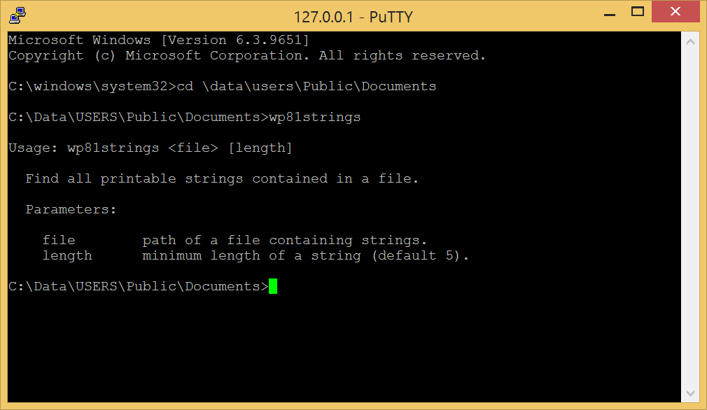
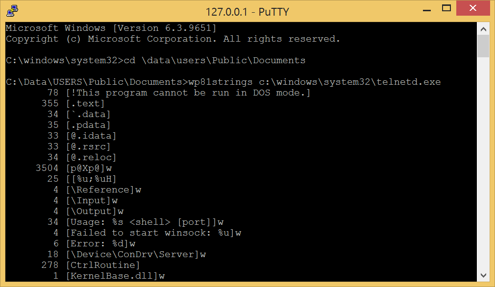

# wp81strings

Attempt to create an equivalent of the [Linux strings command](https://en.wikipedia.org/wiki/Strings_(Unix)) or the [Sysinternals command](https://learn.microsoft.com/en-us/sysinternals/downloads/strings) for Windows Phone 8.1  

## Usage

The strings are displayed between brackets `[ ]`.  
The number, before a string, corresponds to the distance in bytes between this string and the previous (or the start of the file in case of the first string).  
The suffix `w` marks a [wide-character](https://learn.microsoft.com/en-us/windows/win32/midl/wchar-t) string.

> [!NOTE]
> A _string_ is an array of [printable ASCII characters](https://www.ascii-code.com/characters/printable-characters).

## Requirements

### Deployment

- [Install a telnet server on the phone](https://github.com/fredericGette/wp81documentation/tree/main/telnetOverUsb#readme), in order to run the application.  
- Manually copy the executable from the root of this GitHub repository to the shared folder of the phone.
> [!NOTE]
> When you connect your phone with a USB cable, this _shared folder_ is visible in the Explorer of your computer. And in the phone, this folder is mounted in `C:\Data\USERS\Public\Documents`  

### Compilation

- [Visual Studio 2015 with the Windows Phone SDK](https://github.com/fredericGette/wp81documentation/blob/main/ConsoleApplicationBuilding/README.md).  
